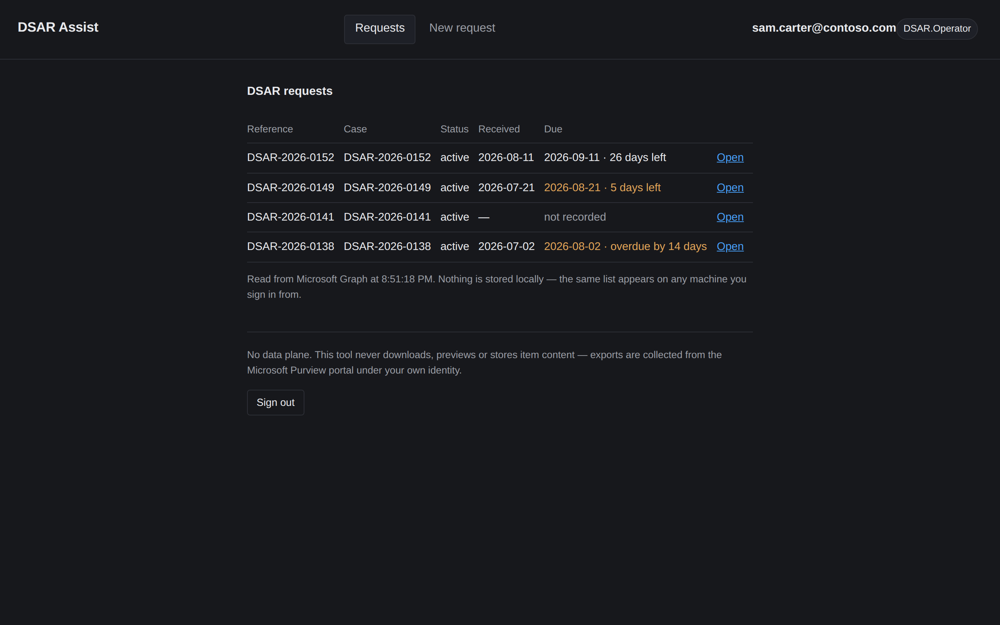
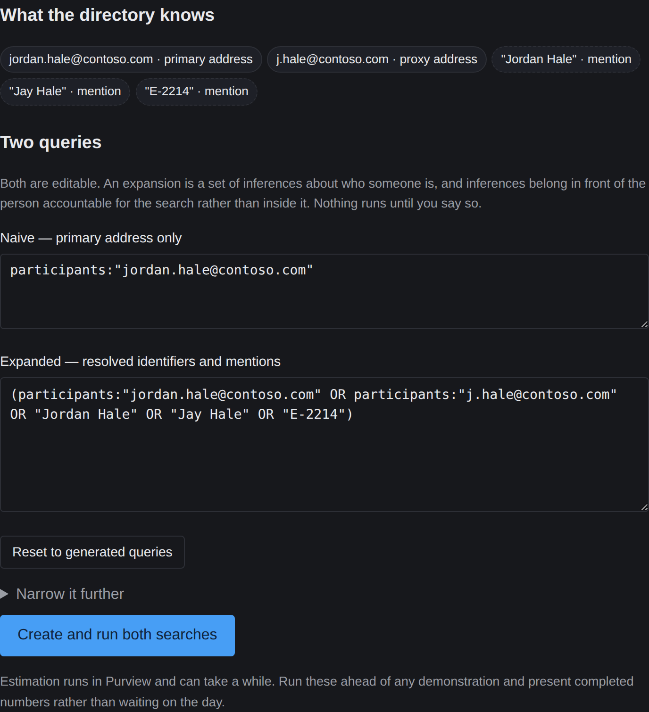

# DSAR Assist

Runs DSAR searches against Microsoft 365 through Purview eDiscovery, tracks
the statutory response deadline, and keeps a tamper-evident record of who
searched for what.

**It has no data plane.** It cannot display a document and it cannot copy one
anywhere. The app registration requests Microsoft Graph and nothing else; the
separate resource carrying the eDiscovery download permission is never named
in this codebase, and no download or preview call exists in the permitted
operations table. Exports are collected from the Purview portal under the
operator's own identity. All of this is asserted by tests at every commit, and
at every sign-in the scopes the identity platform actually granted are checked
against the claim: a download-capable scope refuses the sign-in outright.

## What it does

- **Creates the eDiscovery case** stamped with your DSAR reference. Microsoft
  Graph is the source of truth, so the same case list appears on any machine
  you sign in from and nothing is stored locally.
- **Tracks the statutory clock**: one calendar month from the date of receipt,
  not thirty days, and not from when the case was opened. The due date and
  days remaining appear on the request list. A case with no recorded receipt
  date shows "not recorded" rather than a guessed deadline. Extensions and
  clock pauses are not modelled; the date shown is the baseline.
- **Builds two queries and shows both.** The naive query uses the primary
  address only. The expanded query adds what the directory knows plus what you
  supply (aliases, former names, employee ID). Both are editable and nothing
  runs until you say so. The difference in results is the material a
  primary-address search would have missed.
- **Narrows with reviewed templates**: employment-file vocabulary, privilege
  triage, third-party co-occurrence, date windows, workload splits and file
  types. Templates ship in the image and change only by pull request, because
  a narrowing that is too tight under-discloses. See
  [docs/TEMPLATES.md](docs/TEMPLATES.md).
- **Keeps a hash-chained audit trail**: every action including refusals, with
  the data subject appearing only as a case-scoped pseudonym. Edits and
  deletions are detected and named by record.
- **Produces a per-case evidence pack** suitable for attaching to the
  response. It verifies the whole chain first and refuses to produce a pack
  from a trail that does not verify.

The operator signs in as themselves. The tool can see nothing their own
Purview permissions do not already allow, and holds no credential of its own.



The two queries are always shown before anything runs, side by side and
editable:



And once both estimates complete, the difference is stated plainly:


## What it is not

The narrowness is deliberate. Purview stays authoritative for cases, searches,
review and export; this tool removes the repetitive setup around it and adds
nothing that would make it a second privacy platform. It is not:

- **an intake portal or identity verification.** Requests arrive, and
  requesters are verified, outside this tool.
- **a statutory workflow manager.** It tracks the baseline response date only.
  Extensions, clarification pauses and requester communication are yours.
- **a redaction engine or a disclosure portal.** Review, redaction and
  delivery happen in Purview and whatever your organisation already uses.
- **cross-system discovery.** Microsoft 365 only, through Purview.
- **a repository of responsive data.** There is no data plane; it cannot hold
  what it cannot see.

The security consequences of these boundaries, and the changes that would
reopen them, are in [docs/THREAT-MODEL.md](docs/THREAT-MODEL.md).

---

## Install

`uv` is the only prerequisite: one static binary, no admin rights, no Python
on the host, nothing cloned.

**Windows** (PowerShell):

```powershell
winget install astral-sh.uv
uvx --from git+https://github.com/azurebeard/dsar-assist@v0.1.1 dsar init
uvx --from git+https://github.com/azurebeard/dsar-assist@v0.1.1 dsar up
```

**macOS / Linux:**

```bash
curl -LsSf https://astral.sh/uv/install.sh | sh
uvx --from git+https://github.com/azurebeard/dsar-assist@v0.1.1 dsar init
uvx --from git+https://github.com/azurebeard/dsar-assist@v0.1.1 dsar up
```

`init` runs once. It asks for the two GUIDs identifying your app registration
(neither is a secret), validates them, and writes `~/.dsar/config.json`
owner-only. After that, every run is just `up`.

These commands pin the current release, which is the supported install.
Installing from the branch head or an unpinned image tag is a development
path; for that, clone the repository and use the Develop section below.

**Container**, the second supported path. Multi-arch (amd64 and arm64),
signed, SBOM and provenance attached. Pinned by digest because a tag can be
repointed and a digest cannot; this is the signed digest of the release:

```bash
docker run --rm -p 127.0.0.1:8765:8765 \
  -v ~/.dsar:/home/dsar/.dsar \
  ghcr.io/azurebeard/dsar-assist@sha256:30b2c1726c4fe5cefa42136acd6c79a7966da2ce5388d307739e741c528d9a74
```

The verification command for the signature is in
[docs/SBOM.md](docs/SBOM.md).

From a clone, `./dsar up` on macOS/Linux or `.\dsar.ps1 up` on Windows picks
whichever runtime is available.

If anything is wrong:

```bash
uvx --from git+https://github.com/azurebeard/dsar-assist@v0.1.1 dsar doctor
```

`doctor` names the problem and the fix, including the exact redirect URI to
register.

### One-time tenant setup (an admin, once per tenant)

`infra/entra/provision.sh` creates the Entra app registration idempotently:
single tenant, public client with PKCE, zero credentials of any kind, app
roles (`DSAR.Operator`, `DSAR.Auditor`) with assignment required, and an app
management policy blocking anyone adding a secret later. Assign operators to a
role, grant admin consent, and hand the two GUIDs to whoever runs `init`.
Operators also need an eDiscovery role in Purview; the tool grants nothing and
cannot elevate.

---

## Use

`up` starts a local server on `http://localhost:8765` and opens the browser.
Sign in with your Microsoft account. The roles you hold are shown next to
your name.

1. **New request.** Enter the DSAR reference and the date the request was
   received. The received date drives the deadline and is written once, at
   creation. Left blank, the deadline shows as "not recorded" rather than
   being derived from the creation date.
2. **Resolve the subject.** Primary email, plus anything the directory cannot
   know: nicknames, former names, addresses from the request itself. Review
   the naive and expanded queries side by side. Edit them if needed.
3. **Narrow if needed.** Templates stack onto the queries with AND. Apply to
   both queries unless you mean otherwise; the tool warns when the two stop
   being comparable, and when a narrowing counts mailbox content only.
4. **Run both searches** and leave the page. It polls on its own. Estimates
   return item and location counts per search.
5. **Export.** Starts the export in Purview; collect the results from the
   Purview portal under your own identity.

**Requests list**: every case this tool created, from any machine, with
status, received date and deadline. Overdue and due-soon rows are
highlighted.

**Audit trail**:

```bash
uvx --from git+https://github.com/azurebeard/dsar-assist@v0.1.1 dsar audit verify
uvx --from git+https://github.com/azurebeard/dsar-assist@v0.1.1 dsar audit tail
uvx --from git+https://github.com/azurebeard/dsar-assist@v0.1.1 dsar audit evidence <case-id>
```

`verify` recomputes the hash chain and names the first break if anything was
altered. `evidence` produces the per-case pack: who searched, what was
searched, when, with the chain verification attached. It refuses to produce a
pack from a trail that does not verify. Both work offline.

**Roles**: `DSAR.Operator` can do everything above. `DSAR.Auditor` can view
cases and read the trail, and is refused anything that creates or exports.
The refusal itself is recorded.

---

## Configuration

`init` writes everything a desktop install needs. The full set, for scripting
or hosted mode. Environment wins over the file:

| Variable | Required | Meaning |
|---|---|---|
| `DSAR_CLIENT_ID` | yes | Application ID of the app registration |
| `DSAR_TENANT_ID` | yes | Tenant GUID. Pins the authority; never `/common` |
| `DSAR_MODE` | no | `desktop` or `hosted`. Inferred when unset |
| `DSAR_PORT` | no | Default `8765` |
| `DSAR_AUDIT_DIR` | no | Default `~/.dsar/audit` |
| `DSAR_IDENTITY_EXPANSION` | no | Enables the directory-read scope |
| `DSAR_METRICS` | no | Opt-in workflow timing capture: bounded integers only, no subject data, local file. Method in [docs/BENCHMARK.md](docs/BENCHMARK.md) |
| `DSAR_BASE_URL` | hosted | External origin, used to build the redirect URI |
| `DSAR_UAMI_CLIENT_ID` | hosted | User-assigned managed identity for the client assertion |
| `DSAR_AUDIT_BLOB_URL` | hosted | Append-blob container for the audit trail |

Neither required value is a secret. There is no setting for a client secret,
because no code path could consume one.

The config file must not be writable by group or other. `tenant_id` selects
the Entra tenant the operator signs in to, so whoever can write the file
chooses the identity provider. `init` sets the permissions correctly; if you
write the file by hand on macOS or Linux, `chmod 600 ~/.dsar/config.json`. On
Windows, NTFS inheritance applies and the check is not enforced.

Hosted mode runs the same image on Azure Container Apps with no secret
anywhere and the audit trail in an append blob. See
[`docs/DEPLOY-hosted.md`](docs/DEPLOY-hosted.md).

---

## How it is built

| Property | How it is held |
|---|---|
| No data plane | Download resource never named; structural tests; runtime scope check |
| No secrets | Desktop is a public client with PKCE. Hosted uses a federated credential minted by a managed identity. `doctor` fails if a secret-shaped variable exists |
| Tokens in memory only | `msal.SerializableTokenCache` is banned by a structural test. No keyring, no file cache, no `msal-extensions` |
| State travels | Microsoft Graph is the source of truth. There is no local database; a structural test bans `sqlite3` outright |
| One HTTP choke point | Exactly three modules may import an HTTP client, asserted by test |
| Reproducible | `uv.lock` locks across all platform markers. CI fails on a stale lock |
| Entry points work | The container's `ENTRYPOINT` is the console script, both entry points are asserted to agree, and a test greps these docs for commands that would not run on a fresh machine |
| Container hardened | Distroless runtime with no shell and no package installer, non-root uid 10001, read-only root filesystem, all capabilities dropped, base images digest-pinned. Zero findings above Medium, none fixable |
| Audit trail protected | Hash-chained, append-only by construction, directory forced to `0700`. Two concurrent writers cannot fork it |
| Requests observable | Logged by route template, never by concrete path, so 401s and 403s are visible without copying case identifiers into a second store |

[`docs/CLAIMS.md`](docs/CLAIMS.md) maps every guarantee to the test that fails
when it stops being true, and is itself parsed and enforced by the test suite.
The threat model is in [`docs/THREAT-MODEL.md`](docs/THREAT-MODEL.md) and the
software bill of materials in [`docs/SBOM.md`](docs/SBOM.md).

---

## Develop

```bash
uv sync --frozen
uv run pytest
uv run mypy
uv run dsar doctor --offline
```

The invariant tests run first and alone, so a breach is unambiguous:

```bash
uv run pytest tests/test_structural.py -v
```

Build the image the way CI does:

```bash
docker buildx build --platform linux/amd64,linux/arm64 \
  --sbom=true --provenance=true -t dsar-assist:dev .
```

CI runs the full suite on Ubuntu, macOS and Windows on every push, plus a
container smoke test under the real hardening flags and a blocking
vulnerability scan.

---

## Licence

[MIT](LICENSE).
